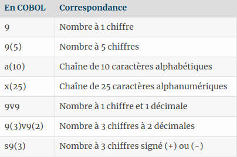

<h1 align="center">COBOL WORKSHOP</h1>

>Introduction au language Cobol via la création d'un mini jeu.


## Un peux d'histoire  :

Cobol est un langage de programmation créé en 1959 (officiellement le 18 septembre 1959). Son nom est l'acronyme de **COmmon Business Oriented Language** qui révèle sa vocation originelle : être un langage commun pour la programmation d'applications de gestion.

Il faut savoir que ce langage, bien que peu connu est omniprésent dans la vie de tous les jours. Une grande majorité des transactions bancaires et des communications transitent par des programmes… en COBOL !


## Pré requis :

Pour ce tutoriel, nous utiliserons l'IDE OpenCobol, disponible via le site : 

- [Version Ubuntu](https://launchpad.net/cobcide/+download)
- [Version MacOs](https://launchpad.net/cobcide/+download)
- [Version Windows](https://launchpad.net/cobcide/+download)

Pour l'installer, suivez simplement les instructions.

## Hello, world ! :

Pour introduire le language, nous allons commencer par créer un simple " Hello, world ! " en language Cobol. 

Ouvrez l'éditeur et créer un nouveau fichier. Choisissez **" program "** et choisissez un endroit ou l'enregistrer ( Je vous conseille de le faire sur le bureau ). Une fois le fichier créé, vous pouvez déja remarquer quelques lignes de code. Nous allons les décortiquer ensemble. Un programme en Cobol est toujours composé de plusieurs divisions :

```sh
IDENTIFICATION DIVISION.
PROGRAM-ID. YOUR-PROGRAM-NAME.
```
Ceci est l'entéte du programme. Il est composé d' **"IDENTIFICATION DIVISION"**, qui est le nom de la division, et de **"PROGRAM-ID"**, qui sera toujours suivi du nom de votre programme

```sh
DATA DIVISION.
FILE SECTION.
WORKING-STORAGE SECTION.
PROCEDURE DIVISION.
```
- **"DATA DIVISION"** est l'endroit ou seront stockée toutes nos données.
- **"FILE SECTION"** décrit les données qui sont envoyées ou proviennent de fichiers.
- **"WORKING-STORAGE SECTION"** est l'endroit ou nous déclarons toutes nos variables.
- **"PROCEDURE DIVISION"** est l'endroit ou votre programme va trouver ce qu’il est censé faire, on y placera nos boucles, conditions, etc.


Vous pouvez remarquer que chaques lignes est succédée d'un point. Celui ci est extrémement important et ne devra pas être oublié.

Par défaut à la création du fichier, une procédure Hello World est déjà créée. Vous pouvez donc remarquer que l'affichage de la phrase dans le terminal se fait grace au mot clé **" DISPLAY "**, qui permet donc d'afficher du texte, ainsi que d'autres choses. Nous le verrons tout à l'heure.

**"STOP RUN"**, quant à lui, permet simplement d'arréter le programme et **"END PROGRAM"** le ferme.

Maintenant que vous avez vu la structure principale du fichier, vous pouvez cliquer sur le bouton "Compile" qui se trouve a gauche du bouton "Clear" dans la barre d'action, ce qui créera le fichier exécutable de votre programme. Vous pourrez retrouver ce fichier dans le dossier "bin" qui se trouve au même endroit que le fichier que vous avez créer au début. Vous n'avez plus qu'à ouvrir un terminal à l'endroit ou se trouve le fichier compilé, et a lancé le fichier en tapant " ./NomDuFichier .

## Allons un peux plus loin :

Maintenant que nous avons vu comment faire un "Hello, World !" simplement, nous allons découvrir comment créer des variables, et des prompts.

Pour ce faire, nous allons utiliser la structure suivante : 

```sh
      IDENTIFICATION DIVISION.
      PROGRAM-ID. Votre-programme.

      DATA DIVISION.
      WORKING-STORAGE SECTION.
         77 nomVariable PIC type.

      SCREEN SECTION.
         1 instruction.

      PROCEDURE DIVISION.
      instruction1.
      instruction2.
      etc.
 
      STOP RUN.
```

Que peux t'on remarqué en voyant ce code ? Nous allons d'abbord voir ce morceau de code :

```sh
 WORKING-STORAGE SECTION.
         77 nomVariable PIC type.
```
C'est ici que nous créons nos variables. La variable "nomVariable" est ici précédée du nombre 77, appellé étiquette. Ce nombre est simplement une convention de nommage des variables en Cobol.

Cette variable est également suivie de "PIC type". PIC est un mot clé qui permet de décrire la forme qu’aura votre variable, et le type bah... c'est le type quoi.

Voici les différents types que nous pouvons utiliser :



Voici un exemple : 

```sh
77 nomVariable PIC 9.
```
Ici, la variable contiendra donc un nombre de 0 à 9.

Maintenant, nous allons passer à **"SCREEN SECTION"**.

Cette section contiendra le code qui sera chargé de gérer les entrées et sorties. Ou autrement dit, c’est ici que l’on mettra tout ce qui est affichage et entrées au clavier.

Voici un exemple de code contenu dans cette section :

```sh
1 NomDuScript.
          2 BLANK SCREEN.
          2 LINE 3 COL 15 VALUE 'Hello world !'.
```

Nous allons décortiqué ensemble ce morceau de code.

Nous avons donc le nom du script ( ici NomDuScript ), le paramétre "BLANK SCREEN" qui va permettre de clear le terminal, et un deuxiéme paramétre qui affichera la valeur "Hello world !".

Les chiffres qui précédent le début de chaques lignes représentent la hiérarchie du script, et pour ce qui est du "LINE 3 COL 15", cela signifie juste que le texte s'affichera à la ligne 3, 15éme colonne, rien de bien compliqué. Cela permet de mettre en page notre application. 

En ce qui concerne **"PROCEDURE DIVISION"**, nous l'avons déjà vu plus tôt dans le workshop.

Nous allons maintenant mettre tout sa en pratique. Nous allons récupérer une variable via un pompt dans le terminal, et le retourner sous forme de phrase dans le terminal. Pour l'exemple, le terminal nous demandera notre prénom, et nous répondra "Bonjour, VotrePrénom !"

Pour commencer, nous allons donc créer une variable dans **"WORKING-STORAGE SECTION"** que nous appelerons "prenom", et qui sera une chaine de charactéres alphanumériques.

Voici la variable :

```sh
77 prenom PIC x(25).
```
Nous allons en suite créer un prompt qui se chargera de poser la question, ce prompt se trouvera donc dans la section **"SCREEN SECTION"** :

```sh
1 pls-prenom.
               2 VALUE 'Quel est ton nom ? '.
               2 PIC x(25) TO prenom REQUIRED.
```
Ainsi qu'un second affichage, qui renverra la valeur récupérée :

```sh
1 pla-prenom.
               2 VALUE 'Bonjour, '.
               2 PIC x(25) FROM prenom.
```
Et, pour finir, on affiche tout sa dans la console via ce code, qui sera placé dans **"PROCEDURE DIVISION"**:

```sh
DISPLAY pls-nom.
       ACCEPT pls-nom.
       DISPLAY pla-nom.
       DISPLAY '.'..
```

Voici donc le code au complet :

```sh
IDENTIFICATION DIVISION.
       PROGRAM-ID. Votre-programme.

       DATA DIVISION.
       WORKING-STORAGE SECTION.
           77 prenom PIC x(25).

       SCREEN SECTION.
           1 pls-prenom.
               2 VALUE 'Quel est ton prenom ? '.
               2 PIC x(25) TO prenom REQUIRED.
           1 pla-prenom.
               2 VALUE 'Bonjour, '.
               2 PIC x(25) FROM prenom.

       PROCEDURE DIVISION.

       DISPLAY pls-prenom.
       ACCEPT pls-prenom.
       DISPLAY pla-prenom.

       STOP RUN.
```

Résultat : Au lancement, le terminal nous demande notre prénom, puis nous dis bonjour.
Rien de bien fou, je sais, mais sa permet déjà d'apréhender le Cobol.

